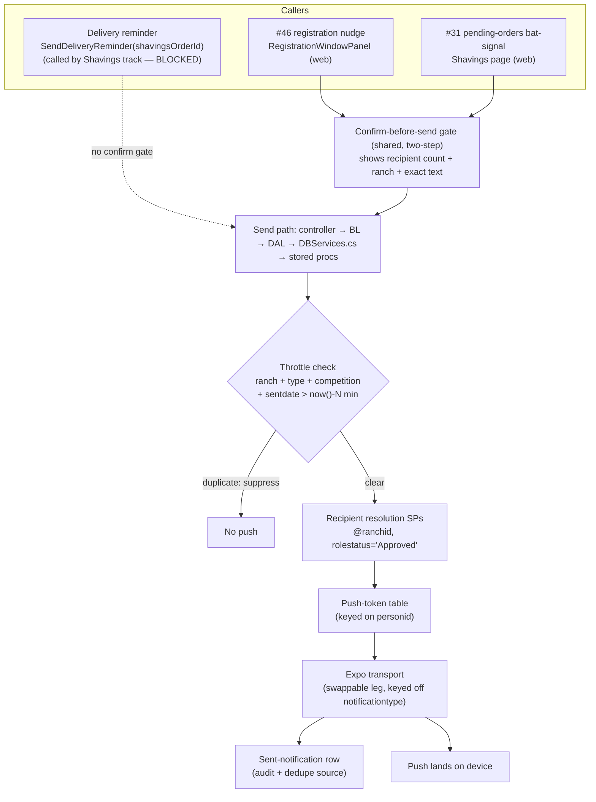
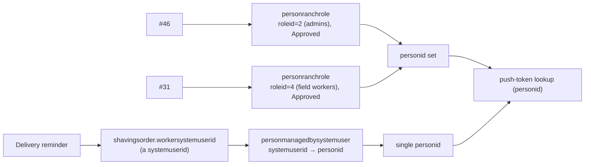

# Architecture Diagrams — Notification Pipeline

## One pipeline, three callers

## Recipient resolution per caller

**Note the asymmetry:** #46 and #31 resolve straight to `personid` (login and roles are personid). Only the delivery reminder crosses the `systemuserid → personid` bridge, and that translation is confined to its edge — it is not a system-wide concern.
