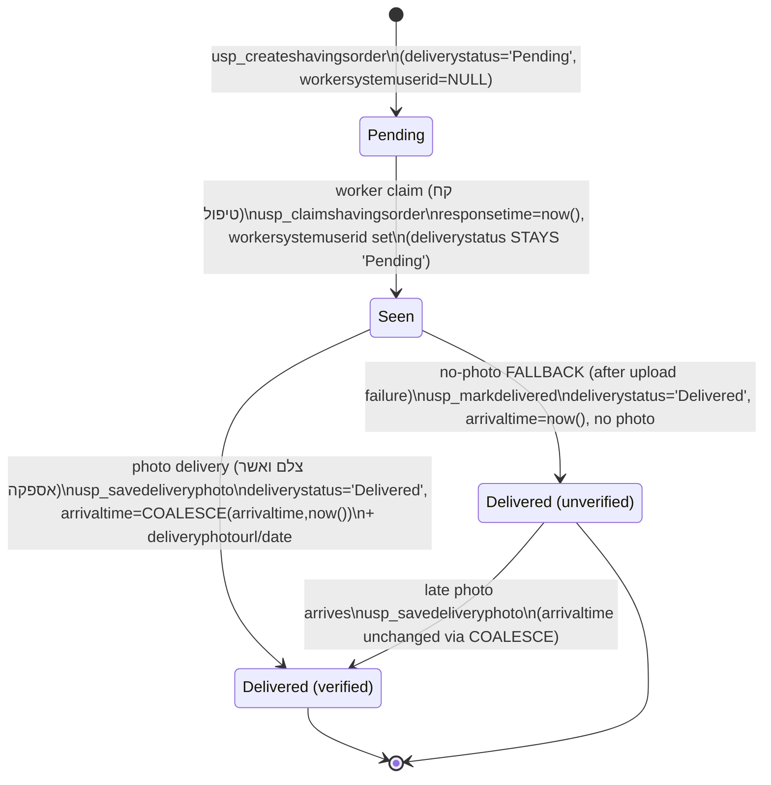

# State Machine — Shavings Order Lifecycle (after Spec 1)

The order's worker-facing lifecycle. The **timestamps are authoritative**; the stored
`deliverystatus` token is coarse and carries only `{Pending, Delivered}`. **`Seen` is a
derived view, never a stored token** — this is what keeps installed old apps (which branch on
`deliveryStatus === 'Pending'`) working through the whole flow. The derived state = `Delivered`
if `arrivaltime` set, else `Seen` if `workersystemuserid` set, else `Pending`.

## Derived-state / stored-token / timestamp / proof matrix

| Derived state | stored `deliverystatus` | `workersystemuserid` | `responsetime` (seen clock) | `arrivaltime` (delivered) | `deliveryphotourl` (proof) | "unverified"? |
|---|---|---|---|---|---|---|
| Pending (unclaimed) | `Pending` | NULL | NULL | NULL | NULL | — |
| Seen (claimed) | `Pending` | set | set* | NULL | NULL | — |
| Delivered (verified) | `Delivered` | set | set* | set | set | no |
| Delivered (unverified) | `Delivered` | set | set* | set | NULL | **yes** |

- **Seen is derived, not stored:** `workersystemuserid IS NOT NULL AND arrivaltime IS NULL`. The stored token stays `Pending`.
- **Unverified is derived, not stored:** `arrivaltime IS NOT NULL AND deliveryphotourl IS NULL`. No new column.
- **\* `responsetime`** is the seen *clock* for new claims; legacy migrated rows read as `Seen` (via `workersystemuserid`) but keep `responsetime` NULL (resolved: no legacy backfill).
- **`Seen` requires a prior claim.** Only a claimed order can be delivered by the worker who took it.
- The retired states `WaitingApproval` and `Closed` no longer occur; the data migration (M8) maps existing rows onto this machine (`WaitingApproval`/`Closed` → `Delivered`).
