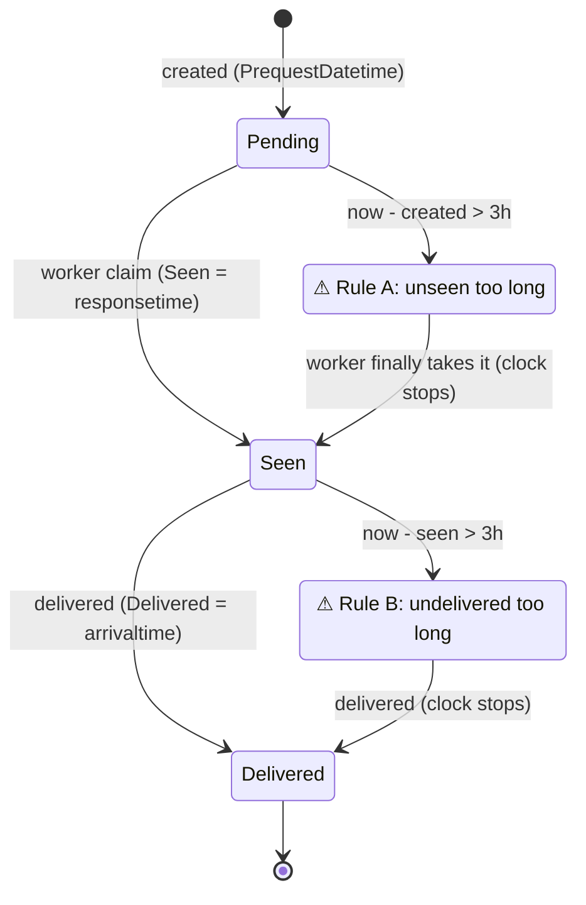

# SLA Delay Flagging (#30)

Grounds CAP-4. Two delay clocks, one named threshold, and how a delayed order is surfaced. The
clock is **seen**, not approved — approval is removed (see Open Question in SPEC.md; confirm wording
with Oren).

## The constant

```js
// shavingsSla.utils.js
export const SHAVINGS_SLA_THRESHOLD_HOURS = 3;
```

The threshold appears **exactly once**, as this constant. No `3`, `3 * 60 * 60 * 1000`, or literal
hour math anywhere else — CAP-4's success criterion.

## The two rules

Both compare against `now` at render time. Fields are from the R2 read (`read-model.md`):
`PrequestDatetime` (created), `Seen` (= `responsetime`), `Delivered` (= `arrivaltime`),
`DeliveryStatus`.

| Rule | Condition | Meaning |
|---|---|---|
| **A — unseen too long** | `DeliveryStatus === "Pending"` **and** `now − PrequestDatetime > threshold` | created but no worker took it within the window |
| **B — undelivered too long** | `Seen` set **and** `Delivered` null **and** `now − Seen > threshold` | a worker saw it but has not delivered within the window |

```js
export function isUnseenTooLong(order, now = Date.now()) {
  return getStatus(order) === "Pending"
    && hoursSince(getCreated(order), now) > SHAVINGS_SLA_THRESHOLD_HOURS;
}
export function isUndeliveredTooLong(order, now = Date.now()) {
  return !!getSeen(order) && !getDelivered(order)
    && hoursSince(getSeen(order), now) > SHAVINGS_SLA_THRESHOLD_HOURS;
}
export function isDelayed(order, now = Date.now()) {
  return isUnseenTooLong(order, now) || isUndeliveredTooLong(order, now);
}
```

- A `Delivered` order is never delayed (both clocks stop at delivery).
- Rule B requires a prior `Seen`; a `Pending` order can only trip Rule A.
- The clocks are mutually exclusive per order (Pending → only A; Seen-undelivered → only B).

## Surfacing (both, per CAP-4)

1. **Needs-attention section** (`ShavingsNeedsAttentionSection.jsx`) — pinned at the **top** of the
   page, above the grouped list, listing every `isDelayed` order regardless of the active grouping.
   Titled **"דורש טיפול"** with a count. Omitted entirely when nothing is delayed (no empty shell).
   Each entry names which clock tripped (unseen since HH:MM / seen-undelivered since HH:MM) so the
   secretary knows the action.
2. **In-row highlight** (`ShavingsSlaBadge.jsx` + row treatment) — the same orders keep a distinct
   warning treatment inside their normal group (a warm-red left border / badge, not a full red row
   that would fight the RTL table). Rule A and Rule B get distinct badge labels.

Colour: reuse the summary page's semantic reds (`text-[#C62828]` / `bg-[#FDECEC]`) for the delay
treatment so it reads as part of the same system, not a bolted-on alert.

## The clocks (diagram)



## Not this

- **Not** an approval clock — there is no approval. The original issue's "approved within 3h"
  becomes "seen within 3h" (Rule A) / "delivered within 3h of seen" (Rule B).
- **Not** a server-computed flag — the SLA is derived at render time from the timestamps R2 exposes
  (matches the whole app's read-time-derivation style; no new column, no new proc).
- **Not** keyed on `RequestedDeliveryTime` — the SLA clocks are creation and seen, not the requested
  delivery slot.
