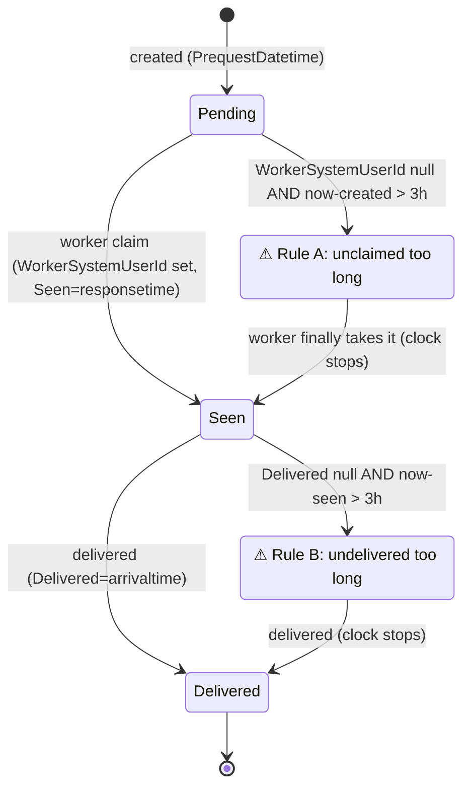

# SLA Delay Flagging (#30)

Grounds CAP-4. Two delay clocks, one named threshold, keyed on Spec 1's shipped fields. The clock is
**seen / delivered**, not approved — approval is gone. Proposed Hebrew badge text is in
`hebrew-labels.md` for approval.

## The constant

```js
// shavingsSla.utils.js
export const SHAVINGS_SLA_THRESHOLD_HOURS = 3;
```

The threshold appears **exactly once**, as this constant — no literal `3` or hour math elsewhere
(CAP-4). Badge strings template the number from it (`מעל ${SHAVINGS_SLA_THRESHOLD_HOURS} שעות`).

## The two rules — keyed on `WorkerSystemUserId`, not the stored token

Status is derived (see `read-model.md`), so the SLA rules test the underlying fields, not
`DeliveryStatus`. Fields from R2: `WorkerSystemUserId`, `PrequestDatetime` (created), `Seen`
(=`responsetime`), `Delivered` (=`arrivaltime`).

| Rule | Condition | Meaning |
|---|---|---|
| **A — unclaimed too long** | `WorkerSystemUserId` null **and** `now − PrequestDatetime > threshold` | created but no worker took it in the window |
| **B — undelivered too long** | `WorkerSystemUserId` set **and** `Delivered` null **and** `now − seenClock > threshold` | a worker took it but has not delivered in the window |

```js
export function isUnclaimedTooLong(order, now = Date.now()) {
  return !getWorkerSystemUserId(order)
    && hoursSince(getCreated(order), now) > SHAVINGS_SLA_THRESHOLD_HOURS;
}
export function isUndeliveredTooLong(order, now = Date.now()) {
  if (!getWorkerSystemUserId(order) || getDelivered(order)) return false;
  // Legacy migrated rows can have Seen null though claimed → fall back to created time.
  const seenClock = getSeen(order) || getCreated(order);
  return hoursSince(seenClock, now) > SHAVINGS_SLA_THRESHOLD_HOURS;
}
export function isDelayed(order, now = Date.now()) {
  return isUnclaimedTooLong(order, now) || isUndeliveredTooLong(order, now);
}
```

- A `Delivered` order is never delayed (both clocks stop at delivery).
- The two clocks are mutually exclusive per order (unclaimed → only A; claimed-undelivered → only B).
- **Legacy fallback (Spec 2's call):** a claimed order with `Seen` null (pre-Spec-1 rows only) uses
  `PrequestDatetime` as the Rule B clock start — excluding it would hide a genuinely stalled delivery.
  Going forward every claim writes `Seen`.

## Surfacing (both, per CAP-4)

1. **Needs-attention section** (`ShavingsNeedsAttentionSection.jsx`) — pinned at the **top**, above the
   grouped list, listing every `isDelayed` order regardless of the active grouping, titled "דורש טיפול"
   with a count. Each entry names which clock tripped so the secretary knows the action. Omitted
   entirely when nothing is delayed (no empty shell).
2. **In-row highlight** (`ShavingsSlaBadge.jsx` + row treatment) — the same orders keep a distinct warm
   warning treatment inside their normal group (a red left-border / badge, not a full red row that
   fights the RTL table). Rule A and Rule B carry distinct badges.

Colour: reuse the summary page's semantic reds (`text-[#C62828]` / `bg-[#FDECEC]`) so the delay reads
as part of the same system, not a bolted-on alert.

## The clocks (diagram)



## Not this

- **Not** an approval clock — there is no approval. The original issue's "approved within 3h" becomes
  Rule A (claimed within 3h of creation) and Rule B (delivered within 3h of being seen).
- **Not** keyed on the stored `DeliveryStatus` token or on `RequestedDeliveryTime` — on
  `WorkerSystemUserId` + the creation/seen/delivered timestamps.
- **Not** a server-computed flag — derived at render time from the fields R2 exposes (matches the app's
  read-time-derivation style; no new column, no new proc).
